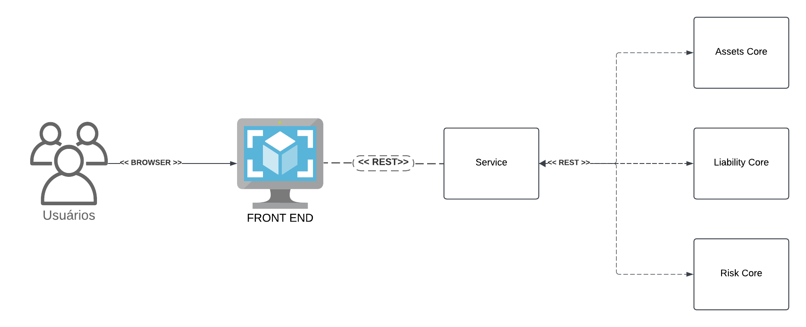
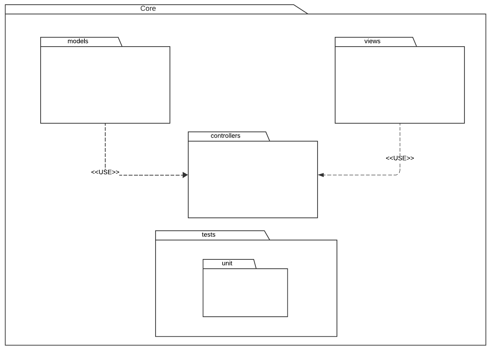

## 1. Introdução

### 1.1 Propósito

Este documento visa apresentar e descrever a arquitetura do ALM considerando o MVP da Lean Inception realizada.

### 1.2 Escopo

O escopo deste documento é entendido como o escopo do ALM e seus componentes. Sendo eles: Cores, Service e Front-end (MVP).

### 1.3 Definições Acrônimos e Abreviações

| Acrônimo | Forma extendida                 |
| -------- | ------------------------------- |
| REST     | Representational State Transfer |
| HTTP     | Hypertext Transfer Protocol     |

## 2. Representação Arquitetural

### 2.1 Service

O **Service** é o serviço responsável por estabelecer a comunicação com o front-end e os demais outros serviços, manipulando os dados do software: ativos, relatórios, gráficos, etc. Utiliza o padrão de arquitetura multi-camadas para a construção e organização do serviço.

### 2.2 Assets Core

O **Assets Core** é o serviço responsável por abstrair a lógica dos modelos matemáticos de ativos do software. Incluindo a utilização de modelos de machine learning, modelos de otimização de portifólio e mais.

### 2.3 Liability Core

O **Assets Core** é o serviço responsável por abstrair a lógica dos modelos matemáticos de passivos do software. Incluindo a utilização de modelos para análise de liquidez da carteira, análise de sensibilidade e simulação de cenários.

### 2.4 Risk Core

O **Risk Core** é o serviço responsável por abstrair a lógica dos modelos matemáticos de risco do software, focado em desenvolver relatórios dinâmicos para análise de risco de diversas frentes do projeto.

### 2.5 Front-end

O front-end é uma das interfaces com o usuário. Neste caso, o front-end é a interface gráfica do software.

## 3. Objetivos Arquiteturais e Restrições

- A arquitetura do software compreende que o software deve ser executado com a necessidade de conexão com a internet.
- Os serviços devem ser executados via docker, sem a necessidade de instalação.

## 4. Visão Lógica

### 4.1 Desenho de Pacotes Arquiteturalmente Significantes

#### 4.1.1 Service

#### 4.1.2 Cores

## 5. Visão de Processo

### 5.1 Fluxo de dados

Os dados fluem sempre do Front-end para o Service, do Service para algunm dos Cores, e vice-versa. Do Service, os dados (tanto do Front-end, quanto do Core) fluem e podem ser persistidos no banco de dados.

## 6. Visão de Implementação

### 6.1 Service

#### 6.1 Camadas

Este serviço utilizará o framework Node.js Express em Typescript.

##### 6.1.1 Controller

Esta é a camada que ficará responsável por receber as requisições dos clientes, e reagirá baseada nos verbos HTTP (GET, HEAD, POST, PUT, PATCH, DELETE, CONNECT, OPTIONS e TRACE).

##### 6.1.2 Model

Esta camada carrega consigo o modelo de domínio, e por obedecer ao padrão Active Record, tem a capacidade de abstrair as tabelas da camada de persistência. Também tem a responsabilidade de abstrair os relacionamentos entre as mesmas.

##### 6.1.3 Service

A service desse serviço é responsável pela lógica de negócio do endpoint.

### 6.2 Cores

Este serviços utilizarão o microframework Fast API. Além disso, a base de código dos modelos matemático estarão contidas em notebooks Python.

#### 6.2.1 Camadas

Esta aplicação utiliza o microframework Fast API, utilizando o padrão MVC. Sendo assim, se comporta como uma **abstração** REST para o modelo matemático.

### 6.3 Front End

#### 6.3.1 React

### 6.4 Metodologia de Desenvolvimento

As metodologias adotadas serão Agile, Scrum e XP.

### 6.5 Padrões de Desenvolvimento

A ferramenta utilizada para versionamento será o GitHub, não há padronização para Editor de Texto ou IDE, mas os repositórios de subsistemas deverão estar configurados com ferramentas de análise estática de código. Prevê assim uma melhor eficiência e padronização dos códigos fonte da equipe. Estas análises serão efetuadas automaticamente, por meio da ferramenta de integração contínua chamada GitHub Actions.

Os testes devem ser realizados ao longo do desenvolvimento, e também será utilizado o SonarCloud para análise estática de qualidade.

### 7.6 Documentação de Endpoints

Os endpoints do Back-end API deverão ser documentados utilizando a ferramenta _Swagger_, facilitando assim a integração da equipe, que no caso podem se diferir, diminuindo o tempo gasto para inclusão de novas funcionalidades e novos membros na equipe.

## 8. Visão de Dados

Estará em uso um banco de dados SQL, o banco de dados PostgreSQL, utilizado pelo Service.

## Versionamento

| Versão | Data       | Descrição                                         | Autor          |
| ------ | ---------- | ------------------------------------------------- | -------------- |
| 1.0    | 04/12/2024 | Documento inicial                                 | Lucas Pimentel |
| 2.0    | 10/12/2024 | Adiciona Diagrama de Pacotes e mais documentações | Lucas Pimentel |
