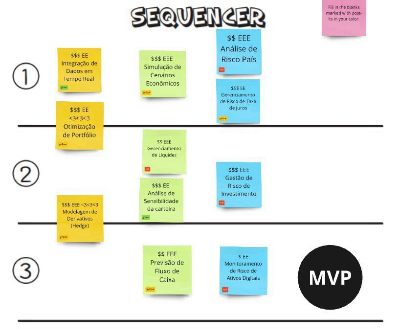

# Priorização de Funcionalidades e MVP

## Introdução

A priorização das funcionalidades para o desenvolvimento da aplicação de fundo de pensão foi realizada utilizando o modelo **Lean**, com o objetivo de maximizar o valor entregue ao usuário, minimizando desperdícios e garantindo um fluxo de trabalho eficiente. A priorização foi feita em uma reunião com todos os membros do grupo de desenvolvimento, onde discutimos as funcionalidades que mais impactariam os usuários e que estariam alinhadas com os objetivos do projeto. A partir dessa priorização, montamos o **Mínimo Produto Viável (MVP)**, focando nas funcionalidades essenciais para a primeira entrega.

## Metodologia de Priorização

A priorização das funcionalidades seguiu os seguintes passos:

1. **Reunião de Priorização**: Todos os membros do grupo participaram de uma reunião para discutir as funcionalidades necessárias, os requisitos dos usuários e as metas do projeto.
2. **Análise de Valor e Esforço**: Utilizamos o modelo Lean para avaliar cada funcionalidade, levando em consideração o valor que ela traria para os usuários e o esforço necessário para implementá-la. Funcionalidades de alto valor e baixo esforço foram priorizadas.
3. **Construção do MVP**: Com base nas funcionalidades priorizadas, determinamos o **MVP**, que contém as funcionalidades essenciais para atender aos requisitos iniciais dos usuários e garantir o funcionamento do sistema com o menor esforço possível.

## Funcionalidades Prioritárias para o MVP

A seguir, apresentamos as funcionalidades priorizadas para a primeira versão da aplicação (MVP):

| **Funcionalidade**                               | **Justificativa**                                                                                      | **Valor** | **Esforço** |
|--------------------------------------------------|-------------------------------------------------------------------------------------------------------|-----------|-------------|
| **Integração de Dados em Tempo Real**            | Permite que os usuários acompanhem as flutuações do mercado em tempo real.                            | Alto      | Médio       |
| **Otimização de Portfólio**                       | Maximiza o retorno e minimiza o risco dos investimentos, essencial para investidores preocupados com segurança. | Alto      | Alto        |
| **Modelagem de Derivativos (Hedge)**              | Ajuda a proteger os investimentos contra riscos financeiros imprevistos e otimizar o retorno.         | Alto      | Alto        |
| **Simulação de Cenários Econômicos**              | Permite simular diferentes cenários econômicos para entender o impacto no portfólio.                  | Alto      | Médio       |
| **Gerenciamento de Liquidez**                     | Garante que o portfólio tenha a liquidez necessária para emergências ou novas oportunidades de investimento. | Médio     | Médio       |
| **Análise de Sensibilidade da Carteira**          | Permite analisar como mudanças em variáveis econômicas afetam o desempenho do portfólio.             | Alto      | Médio       |
| **Previsão de Fluxo de Caixa**                    | Ajuda os usuários a planejarem melhor seus investimentos para garantir uma aposentadoria confortável.  | Alto      | Médio       |
| **Análise de Risco do País**                      | Avalia os riscos geopolíticos e econômicos ao investir em mercados internacionais.                    | Médio     | Alto        |
| **Gerenciamento de Risco da Taxa de Juros**       | Permite entender o impacto das variações nas taxas de juros sobre os investimentos.                   | Médio     | Médio       |
| **Gestão de Risco de Investimento**               | Avalia os riscos associados ao portfólio de investimentos para garantir uma distribuição equilibrada e segura. | Alto      | Alto        |
| **Monitoramento de Risco de Ativos Digitais**     | Permite monitorar o risco dos ativos digitais, como criptomoedas, para proteger o portfólio contra volatilidades extremas. | Alto      | Médio       |

<figcaption>Fonte: Lean inception da equipe</figcaption>

## Conclusão

A priorização das funcionalidades seguiu os princípios do Lean, buscando equilibrar o valor das funcionalidades com o esforço necessário para desenvolvê-las. A partir da reunião com a equipe, definimos um MVP focado nas funcionalidades mais críticas para os usuários, garantindo que a aplicação atenda às suas necessidades básicas enquanto continuamos com o desenvolvimento de funcionalidades mais avançadas nas próximas etapas.

## Bibliografia

- Poppendieck, M., & Poppendieck, T. (2003). *Lean Software Development: An Agile Toolkit*. Addison-Wesley Professional.
- Cohn, M. (2004). *User Stories Applied: For Agile Software Development*. Addison-Wesley Professional.

## Tabela de versionamento

| Versão| Data | Descrição | Responsável|
|-------|------|-----------|------------|
| 1.0 | 10/11/2024 | Documentação da priorização e mvp | Marcos Deus |
